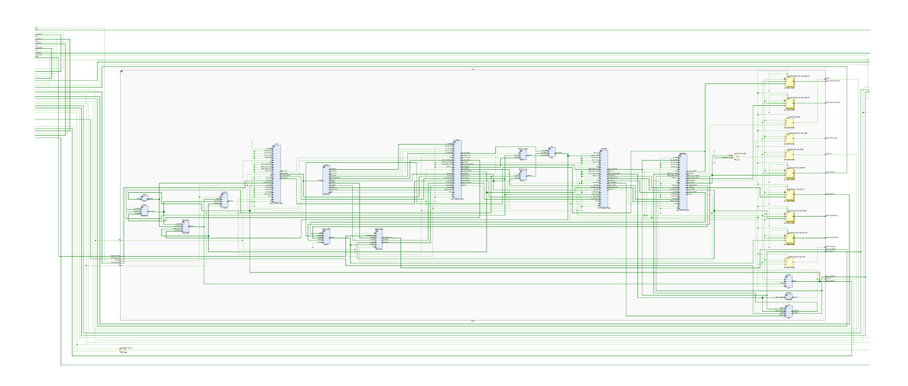
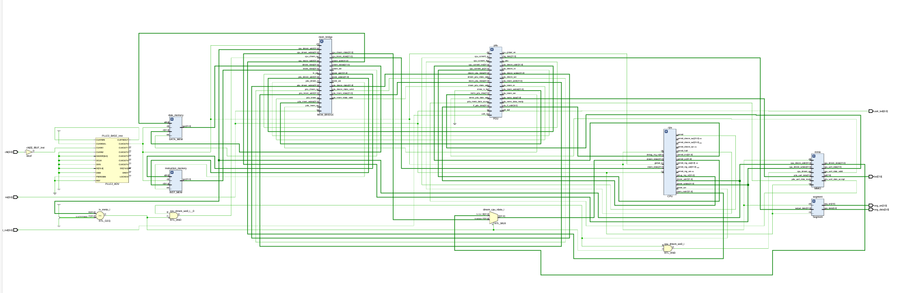

# Five-stage-pipeline-simple-CPU-with-LA32R

基于LA32R的五级流水线CPU（不含高速缓存），所有代码均为本人编写（与RISC-V的区别仅在于编码器的接收格式）

仅发布本人编写的CPU核心部分，另有顶层模块和MEM、PDU模块内容暂不提供

CPU核心部分结构图：

包含MEM、PDU的完整结构图：

说明文档参见：[USTC SOC Homepage](https://soc.ustc.edu.cn/COD/)

LA32R在线运行请移步[LARS](https://jyjsxx.github.io/)

代码正确性测试框架请移步[LA32R-Simulation-Framework](https://github.com/USTC-Loong-COD/LA32R-Simulation-Framework/)
